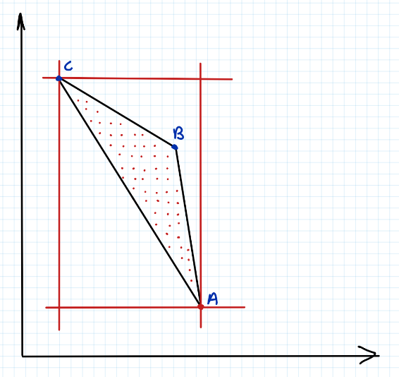
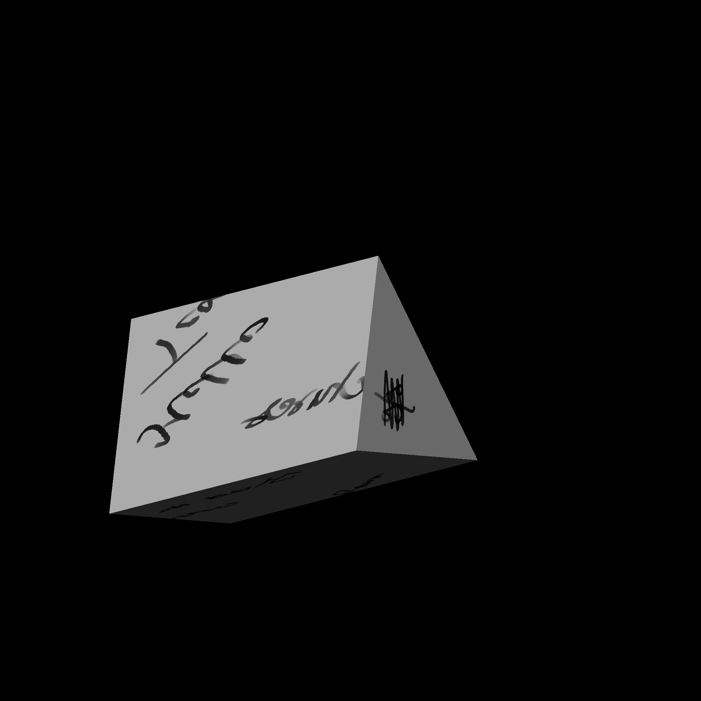
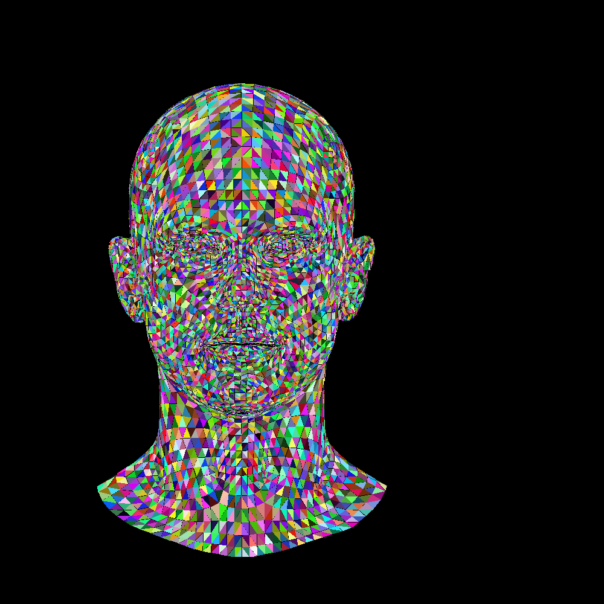

# 3D Renderer from Scratch

This project is a showcase of my journey in building a 3D renderer from scratch in C#. This repository serves as a personal checkpoint to document my progress and achievements.

## Features Implemented So Far

Here is what I have learned and built:
- **Image Creation**: Creating and saving an image file using ImageSharp.
- **Pixel Rendering**: Coloring individual pixels within the image.
- **Line Drawing**: Implementing a line-drawing algorithm.
- **OBJ Loader**: Created a custom class to parse and load Wavefront `.obj` files.
- **Data Structures**: Implemented a 3D vector structure and arrays to store parsed face data.
- **Wireframe Rendering**: Rendering parsed 3D faces directly onto a 2D image file.
- **Triangles and filling**: Using barycentric coordinates to find every pixel inside the triangle and fill them.
- **Rasterization**: Rendering the triagulated mesh by using a for loop to get each faces of the mesh that is in triangle form.

## How I fill the triangle
To efficiently render and fill triangle, algorithm uses **bounding box method** combined with **Barycentric coordinates**. 
- Instead of checking every pixel on the image, we uses bounding box around the triangle.
- A nested two dimensional (x, y) for loop iterates through all the pixels.
- and uses barycentric coordinates to check if any point is negative(i.e. less than 0) then we simple continue or else we color the pixel


<details>
<summary>Click to expand</summary>

```C#
static void triangle(List<Vec2> pts, Image<Rgba32> image, Color? color = null)
{
    Color chosenColor = color ?? Color.Red;
    Rgba32 finalPixelColor = chosenColor.ToPixel<Rgba32>();
    Vec2 bboxMin = new(image.Width - 1, image.Height - 1);
    Vec2 bboxMax = new(0, 0);
    Vec2 clamp = new(image.Width - 1, image.Height - 1);
    for(int i = 0; i < 3; i++)
    {
        bboxMin.X = Math.Max(0.0, Math.Min(pts[i].X, bboxMin.X));
        bboxMin.Y = Math.Max(0.0, Math.Min(pts[i].Y, bboxMin.Y));

        bboxMax.X = Math.Min(clamp.X, Math.Max(pts[i].X, bboxMax.X));
        bboxMax.Y = Math.Min(clamp.Y, Math.Max(pts[i].Y, bboxMax.Y));
    }
    Vec2 P = new();
    for (P.X = bboxMin.X; P.X <= bboxMax.X; P.X++)
    {
        for (P.Y = bboxMin.Y; P.Y <= bboxMax.Y; P.Y++)
        {
            Vec3 screen = Barycentric(pts, P);
            if (screen.X < 0 || screen.Y < 0 || screen.Z < 0) continue;
            image[(int)P.X, (int)P.Y] = finalPixelColor;
        }
    }
}
```

</details>

## Rasterization Process

<details>
<summary>Click to to see the algorithm</summary>

```C#
foreach(var face in faces)
{
    for(int i = 0; i < 3; i++)
    {
        var vert = vertices[face[i]];
        faceFormation.Add(new(
            (vert.X + 2) * width * multiplier, 
            (vert.Y + 2) * height* multiplier 
        ));
    }
    triangle(faceFormation, image, color));
    faceFormation.Clear();    
}
```

</details>
With this program we are coloring every trianglulated faces of the mesh, hence we call this process rasterization

## Some notes
- Alignment issues can be fixed with some basic maths here.
- Currenly only work with Wavefront object( files with .obj extension ).
- No Automatic triangulation so I need to make that.

## Output

Here is the output rendered by the current code:





---

Following tutorial by - [Dmitry V. Sokolov](https://github.com/ssloy/tinyrenderer)